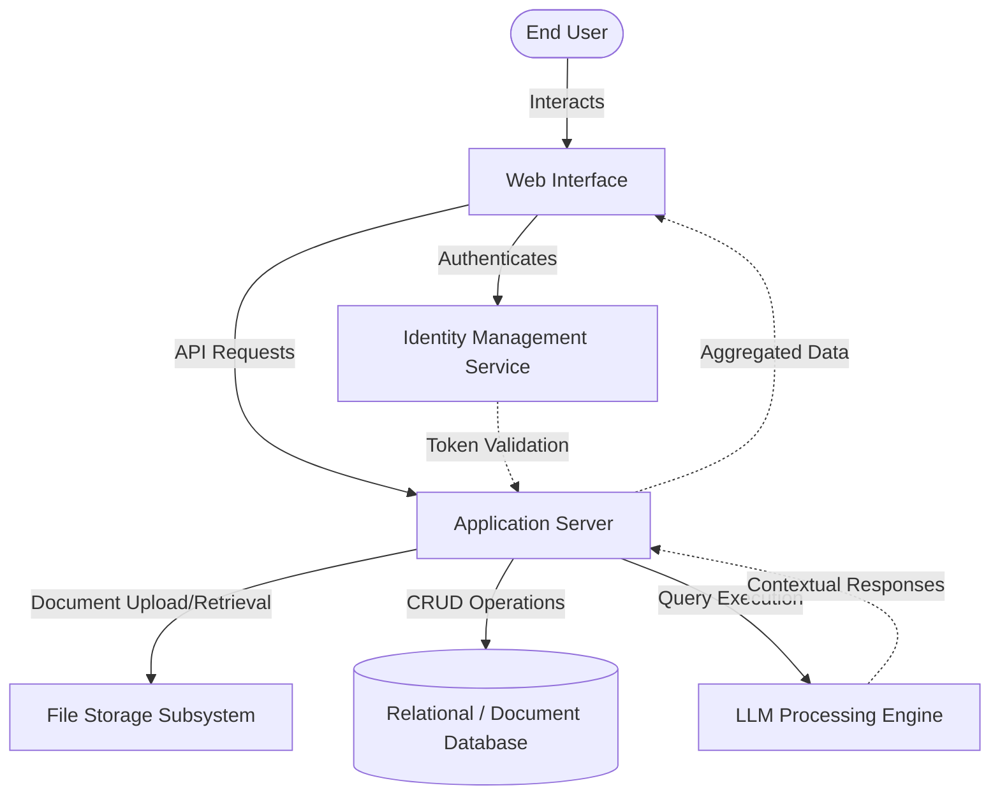

# Hellfire-Scholar: Academic Management Platform

## Project Overview

Hellfire-Scholar is an advanced academic management solution tailored to optimize the educational workflows of modern institutions and individual scholars. It centralizes fragmented academic processes into a unified, secure platform, ensuring seamless management of course materials, progress tracking, and AI-driven support. By abstracting the complexities of document handling, authentication, and scheduling, the product provides a robust environment that accelerates learning and enhances administrative efficiency.

## Scope of Operation

The platform operates across several core academic domains:
- **Resource Management:** Centralized storage, retrieval, and organization of academic notes and reference materials.
- **Academic Tracking:** Real-time monitoring of course assignments, submissions, and individual attendance metrics.
- **Curriculum Structuring:** Digitization and structured presentation of course syllabi for long-term planning.
- **Intelligent Assistance:** An integrated AI system to provide immediate, context-aware responses to complex academic queries, reducing dependency on external search tools.

## Product Capabilities & Workflow

The platform provides a highly integrated workflow connecting the user interface directly to robust backend services and data stores.

### User Journey and Workflow
1. **Secure Onboarding:** Users authenticate via a robust identity and access management system, ensuring that academic records and uploaded documents are strictly isolated and protected.
2. **Dashboard Navigation:** Upon authentication, users are presented with a unified dashboard aggregating real-time data on upcoming assignments, attendance status, and recent notes.
3. **Resource Interaction:** Users can upload, parse, and retrieve course materials. The platform handles file processing and persistent storage securely.
4. **AI-Enhanced Learning:** Users engage with the embedded intelligent assistant for on-demand tutoring, syllabus queries, or topic elaboration, relying on natural language processing capabilities.

### System Architecture Workflow

## Technologies Used

The project is built upon a modern, high-performance technology stack designed for scalability and rapid iteration:

- **Frontend Application Layer:**
  - **React:** Component-based UI rendering.
  - **Vite:** High-speed build tooling and development server.
  - **React Router:** Client-side routing for seamless navigation.

- **Backend Services Layer:**
  - **Node.js & Express.js:** Event-driven, non-blocking I/O server infrastructure for RESTful API routing and middleware management.
  - **Multer:** Middleware for handling multipart/form-data, facilitating secure document uploads.

- **Data & Storage:**
  - **MongoDB & Mongoose:** NoSQL database infrastructure for flexible schema modeling of assignments, attendance, and user data.
  - **Local Storage System:** Managed file system integration for static academic resource persistence.

- **Authentication & Security:**
  - **Clerk:** Comprehensive identity management, handling user sessions, secure sign-in workflows, and cryptographic token validation.

- **Artificial Intelligence:**
  - **Google Gemini (GenAI):** Advanced large language model integration to power the chatbot, offering conversational AI capabilities tailored for educational context.

## Benefits of Use

- **Centralized Data Silos:** Eliminates the need for multiple disparate tools by bringing notes, assignments, and attendance tracking into a single ecosystem.
- **Data Security and Privacy:** Enterprise-grade authentication ensures that sensitive academic records and intellectual property remain protected against unauthorized access.
- **Scalable Architecture:** The separation of concerns between the client interface and backend services allows the platform to scale effortlessly as the user base and data volume grow.
- **Accelerated Learning:** The integration of an AI language model provides instantaneous tutoring and query resolution, significantly reducing research time for students.
- **High Availability and Performance:** Utilizing a modern Vite-powered React frontend alongside a lightweight Express server ensures rapid load times and highly responsive user interactions.